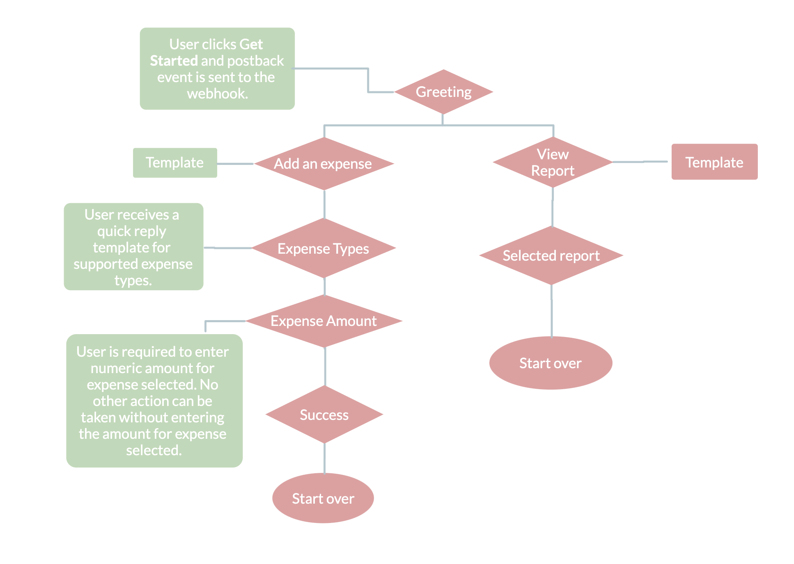

# Chatbot - Facebook Workplace Integration

A custom integration for Facebook Workplace that helps users to manage expenses and create customized reports. Chatbot uses Facebook's Graph API to interact with the Facebook Workplace Chat component. The backend API is written in Node.js and uses Express web framework for API endpoints. [Facebook Workplace Documentation](https://developers.facebook.com/docs/workplace/)
provides useful information for setting up webhooks and authenticating Graph API calls.

## Message Tree

